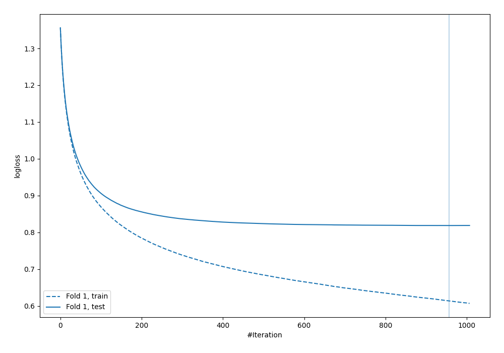

# Summary of 1_Default_Xgboost

[<< Go back](../README.md)

## Extreme Gradient Boosting (Xgboost)
- **n_jobs**: -1
- **objective**: multi:softprob
- **eta**: 0.075
- **max_depth**: 6
- **min_child_weight**: 1
- **subsample**: 1.0
- **colsample_bytree**: 1.0
- **eval_metric**: mlogloss
- **num_class**: 4
- **explain_level**: 2

## Validation
 - **validation_type**: split
 - **train_ratio**: 0.75
 - **shuffle**: True
 - **stratify**: True

## Optimized metric
logloss

## Training time

129.0 seconds

### Metric details
|           |           0 |           1 |           2 |           3 |   accuracy |    macro avg |   weighted avg |   logloss |
|:----------|------------:|------------:|------------:|------------:|-----------:|-------------:|---------------:|----------:|
| precision |    0.685262 |    0.674001 |    0.707523 |    0.60478  |   0.665967 |     0.667891 |       0.667891 |   0.81851 |
| recall    |    0.6404   |    0.780133 |    0.615733 |    0.6276   |   0.665967 |     0.665967 |       0.665967 |   0.81851 |
| f1-score  |    0.662072 |    0.723194 |    0.658444 |    0.615979 |   0.665967 |     0.664922 |       0.664922 |   0.81851 |
| support   | 7500        | 7500        | 7500        | 7500        |   0.665967 | 30000        |   30000        |   0.81851 |

## Confusion matrix
|              |   Predicted as 0 |   Predicted as 1 |   Predicted as 2 |   Predicted as 3 |
|:-------------|-----------------:|-----------------:|-----------------:|-----------------:|
| Labeled as 0 |             4803 |             1196 |              555 |              946 |
| Labeled as 1 |              614 |             5851 |              291 |              744 |
| Labeled as 2 |              813 |              683 |             4618 |             1386 |
| Labeled as 3 |              779 |              951 |             1063 |             4707 |

## Learning curves

## Permutation-based Importance

## Confusion Matrix

## Normalized Confusion Matrix

## ROC Curve

## Precision Recall Curve

[<< Go back](../README.md)
