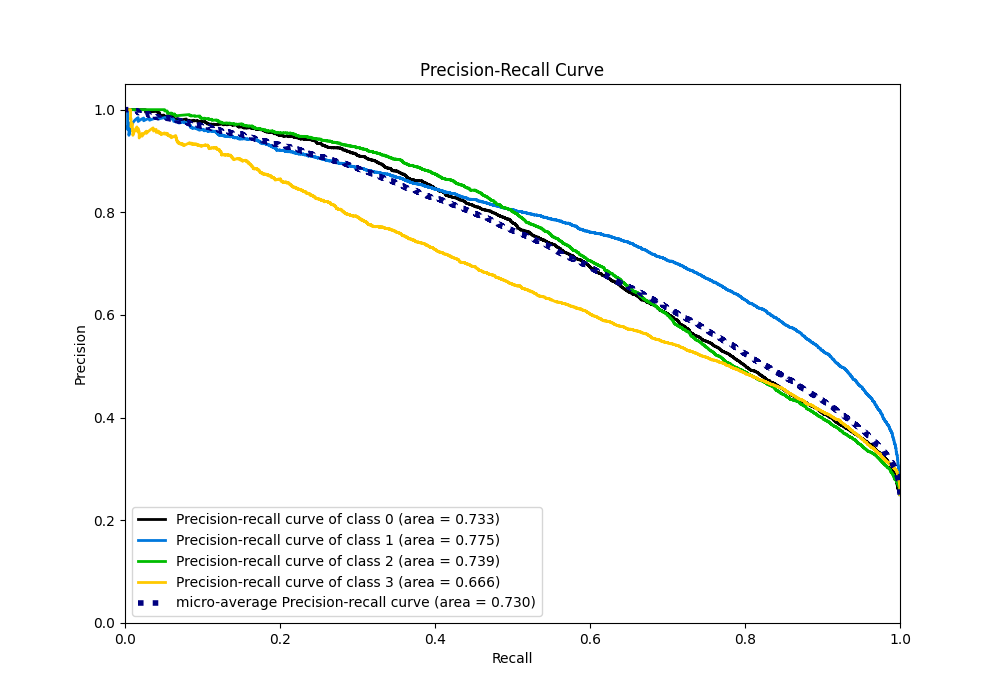

# Summary of 2_Default_NeuralNetwork

[<< Go back](../README.md)

## Neural Network
- **n_jobs**: -1
- **dense_1_size**: 32
- **dense_2_size**: 16
- **learning_rate**: 0.05
- **num_class**: 4
- **explain_level**: 2

## Validation
 - **validation_type**: split
 - **train_ratio**: 0.75
 - **shuffle**: True
 - **stratify**: True

## Optimized metric
logloss

## Training time

91.1 seconds

### Metric details
|           |           0 |           1 |           2 |           3 |   accuracy |    macro avg |   weighted avg |   logloss |
|:----------|------------:|------------:|------------:|------------:|-----------:|-------------:|---------------:|----------:|
| precision |    0.704468 |    0.649592 |    0.716172 |    0.556076 |   0.646367 |     0.656577 |       0.656577 |  0.867428 |
| recall    |    0.578133 |    0.764267 |    0.578667 |    0.6644   |   0.646367 |     0.646367 |       0.646367 |  0.867428 |
| f1-score  |    0.635079 |    0.702279 |    0.640118 |    0.605431 |   0.646367 |     0.645727 |       0.645727 |  0.867428 |
| support   | 7500        | 7500        | 7500        | 7500        |   0.646367 | 30000        |   30000        |  0.867428 |

## Confusion matrix
|              |   Predicted as 0 |   Predicted as 1 |   Predicted as 2 |   Predicted as 3 |
|:-------------|-----------------:|-----------------:|-----------------:|-----------------:|
| Labeled as 0 |             4336 |             1341 |              604 |             1219 |
| Labeled as 1 |              516 |             5732 |              220 |             1032 |
| Labeled as 2 |              660 |              773 |             4340 |             1727 |
| Labeled as 3 |              643 |              978 |              896 |             4983 |

## Learning curves

## Permutation-based Importance

## Confusion Matrix

## Normalized Confusion Matrix

## ROC Curve

## Precision Recall Curve

[<< Go back](../README.md)
