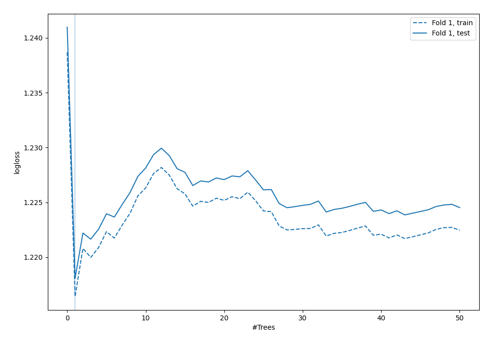
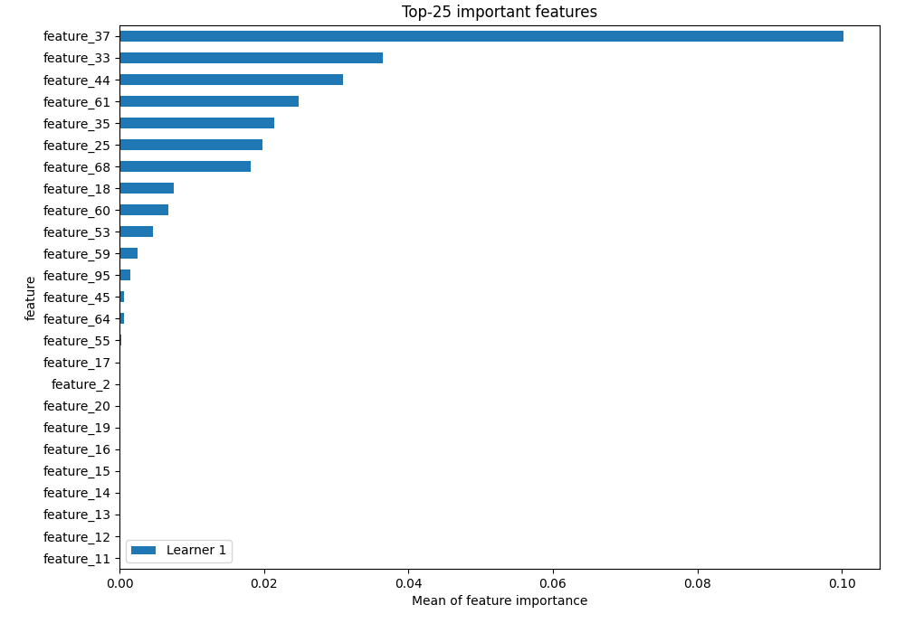
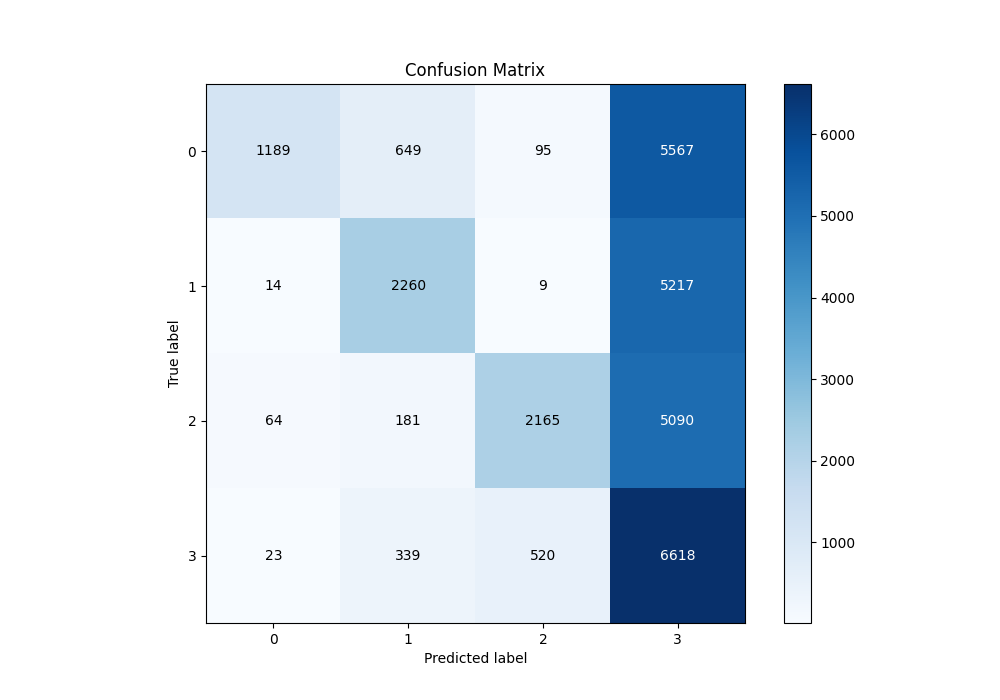
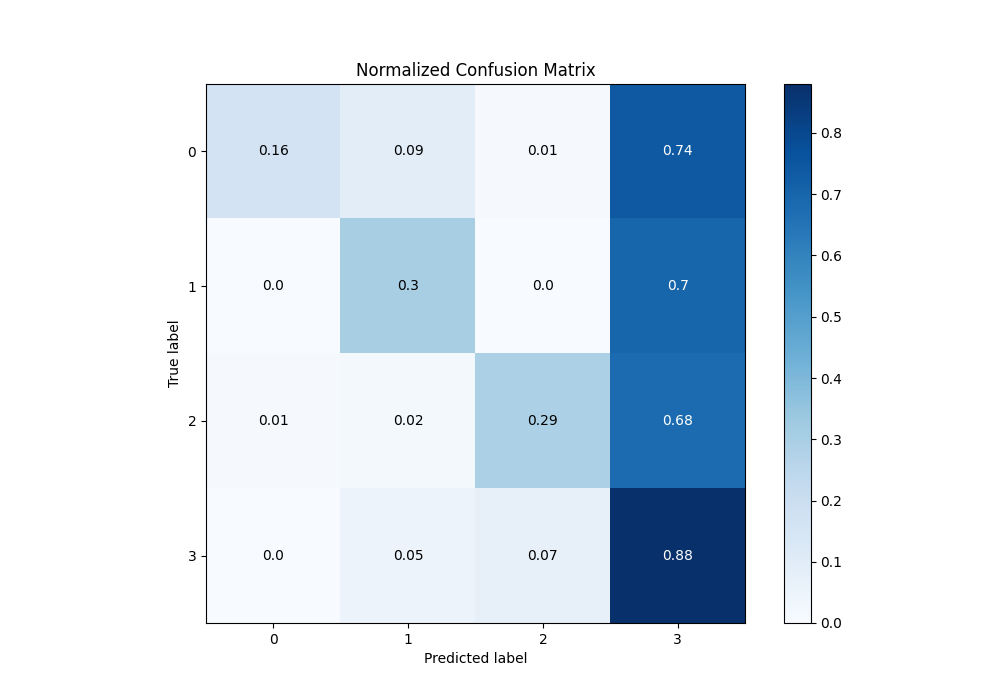
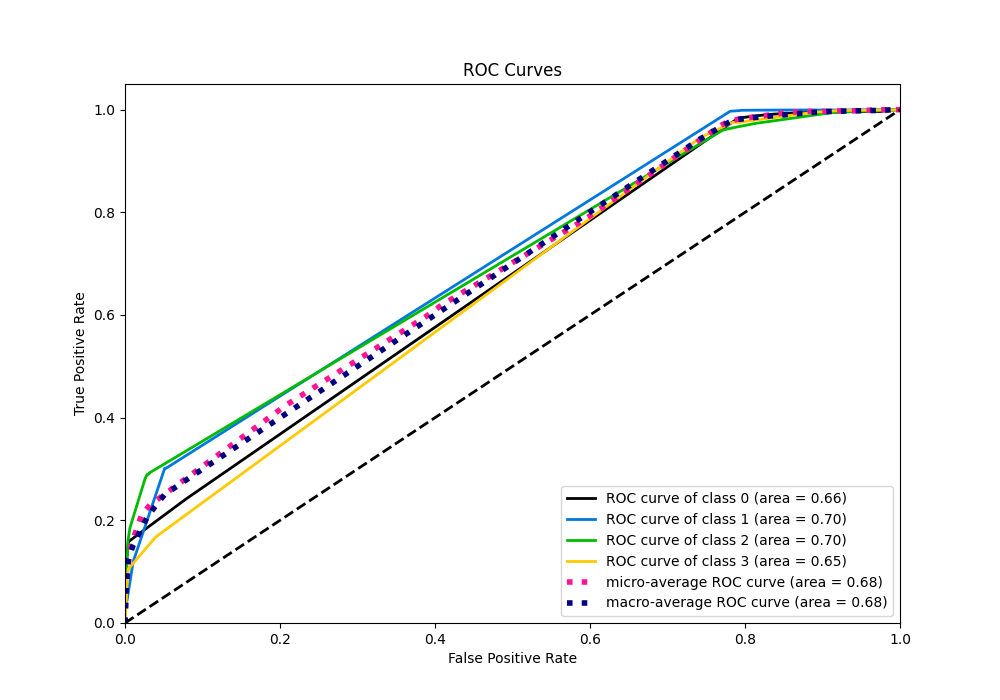
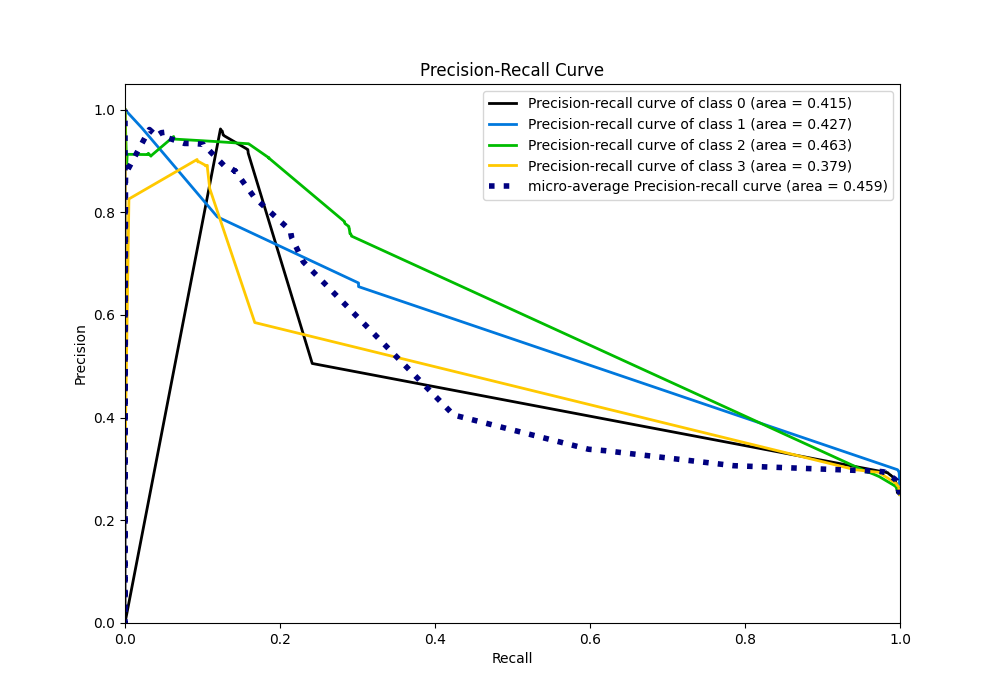

# Summary of 3_Default_RandomForest

[<< Go back](../README.md)

## Random Forest
- **n_jobs**: -1
- **criterion**: gini
- **max_features**: 0.9
- **min_samples_split**: 30
- **max_depth**: 4
- **eval_metric_name**: logloss
- **num_class**: 4
- **explain_level**: 2

## Validation
 - **validation_type**: split
 - **train_ratio**: 0.75
 - **shuffle**: True
 - **stratify**: True

## Optimized metric
logloss

## Training time

18.7 seconds

### Metric details
|           |           0 |           1 |           2 |           3 |   accuracy |    macro avg |   weighted avg |   logloss |
|:----------|------------:|------------:|------------:|------------:|-----------:|-------------:|---------------:|----------:|
| precision |    0.921705 |    0.659084 |    0.776264 |    0.294238 |   0.407733 |     0.662823 |       0.662823 |   1.21806 |
| recall    |    0.158533 |    0.301333 |    0.288667 |    0.8824   |   0.407733 |     0.407733 |       0.407733 |   1.21806 |
| f1-score  |    0.270535 |    0.413579 |    0.420838 |    0.441318 |   0.407733 |     0.386567 |       0.386567 |   1.21806 |
| support   | 7500        | 7500        | 7500        | 7500        |   0.407733 | 30000        |   30000        |   1.21806 |

## Confusion matrix
|              |   Predicted as 0 |   Predicted as 1 |   Predicted as 2 |   Predicted as 3 |
|:-------------|-----------------:|-----------------:|-----------------:|-----------------:|
| Labeled as 0 |             1189 |              649 |               95 |             5567 |
| Labeled as 1 |               14 |             2260 |                9 |             5217 |
| Labeled as 2 |               64 |              181 |             2165 |             5090 |
| Labeled as 3 |               23 |              339 |              520 |             6618 |

## Learning curves

## Permutation-based Importance

## Confusion Matrix

## Normalized Confusion Matrix

## ROC Curve

## Precision Recall Curve

[<< Go back](../README.md)
