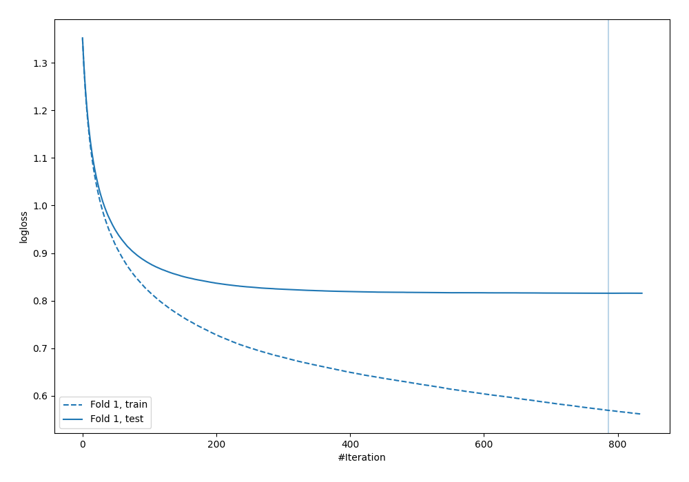
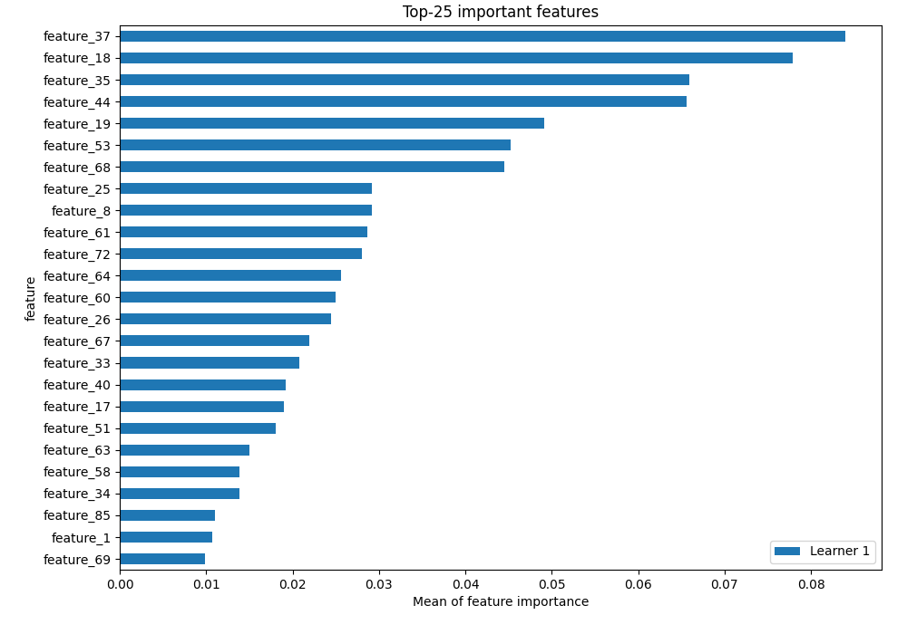
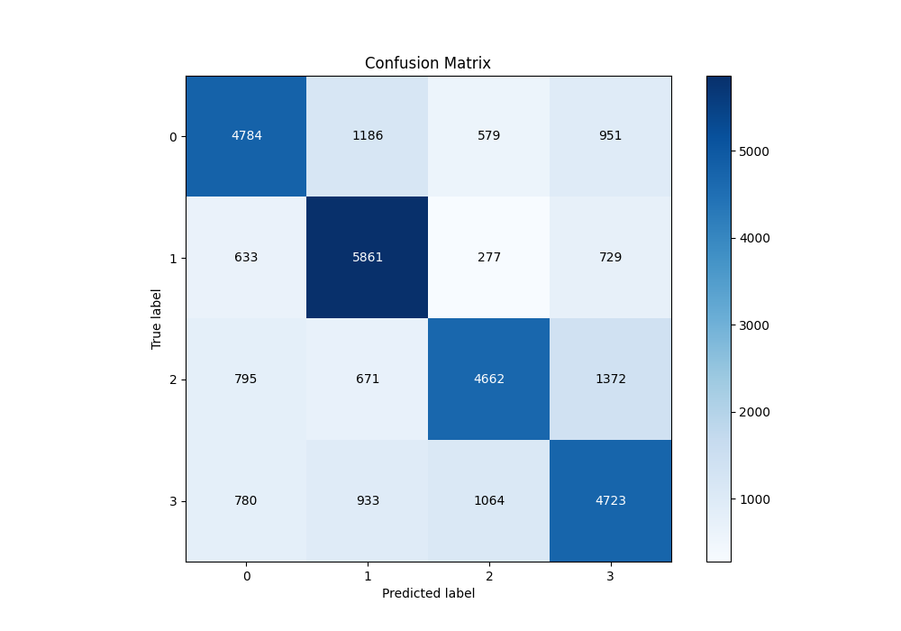
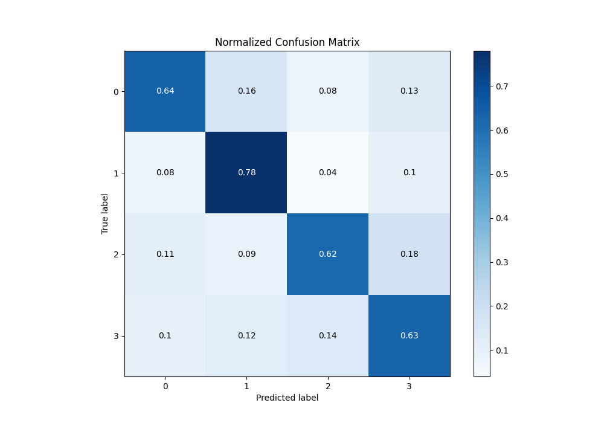
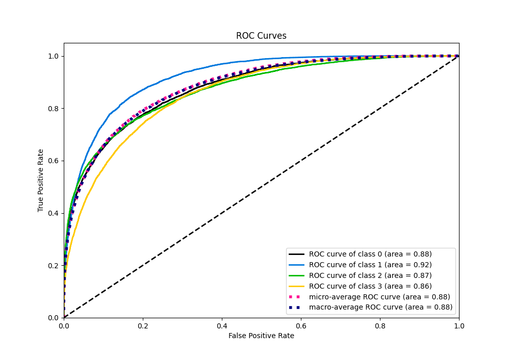
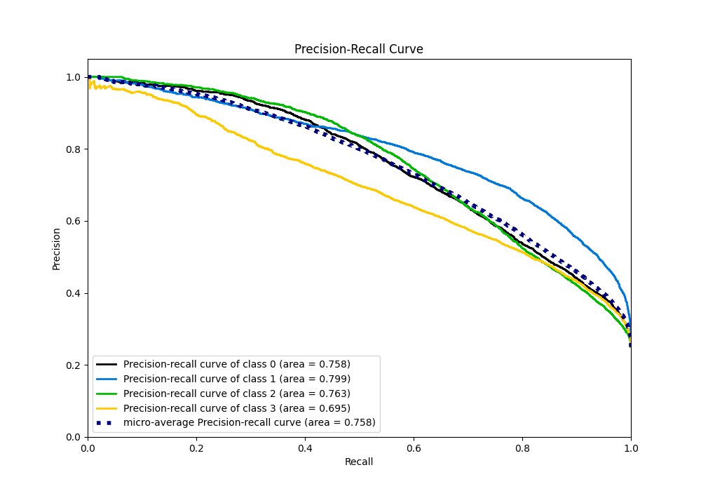

# Summary of 4_Xgboost

[<< Go back](../README.md)

## Extreme Gradient Boosting (Xgboost)
- **n_jobs**: -1
- **objective**: multi:softprob
- **eta**: 0.075
- **max_depth**: 8
- **min_child_weight**: 5
- **subsample**: 1.0
- **colsample_bytree**: 1.0
- **eval_metric**: mlogloss
- **num_class**: 4
- **explain_level**: 2

## Validation
 - **validation_type**: split
 - **train_ratio**: 0.75
 - **shuffle**: True
 - **stratify**: True

## Optimized metric
logloss

## Training time

132.5 seconds

### Metric details
|           |           0 |           1 |           2 |           3 |   accuracy |    macro avg |   weighted avg |   logloss |
|:----------|------------:|------------:|------------:|------------:|-----------:|-------------:|---------------:|----------:|
| precision |    0.684211 |    0.677494 |    0.708295 |    0.60746  |   0.667667 |     0.669365 |       0.669365 |  0.815552 |
| recall    |    0.637867 |    0.781467 |    0.6216   |    0.629733 |   0.667667 |     0.667667 |       0.667667 |  0.815552 |
| f1-score  |    0.660226 |    0.725775 |    0.662122 |    0.618396 |   0.667667 |     0.66663  |       0.66663  |  0.815552 |
| support   | 7500        | 7500        | 7500        | 7500        |   0.667667 | 30000        |   30000        |  0.815552 |

## Confusion matrix
|              |   Predicted as 0 |   Predicted as 1 |   Predicted as 2 |   Predicted as 3 |
|:-------------|-----------------:|-----------------:|-----------------:|-----------------:|
| Labeled as 0 |             4784 |             1186 |              579 |              951 |
| Labeled as 1 |              633 |             5861 |              277 |              729 |
| Labeled as 2 |              795 |              671 |             4662 |             1372 |
| Labeled as 3 |              780 |              933 |             1064 |             4723 |

## Learning curves

## Permutation-based Importance

## Confusion Matrix

## Normalized Confusion Matrix

## ROC Curve

## Precision Recall Curve

[<< Go back](../README.md)
