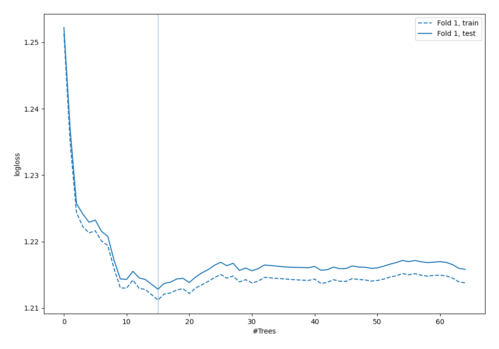
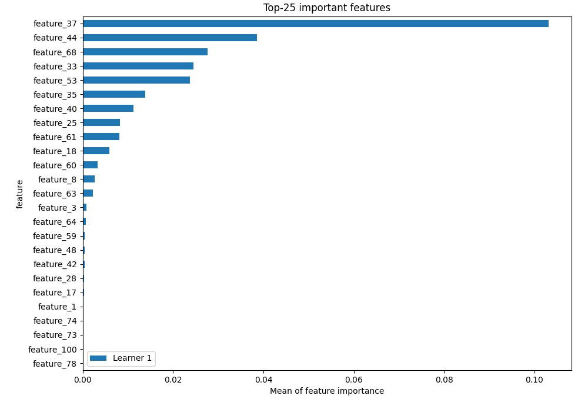
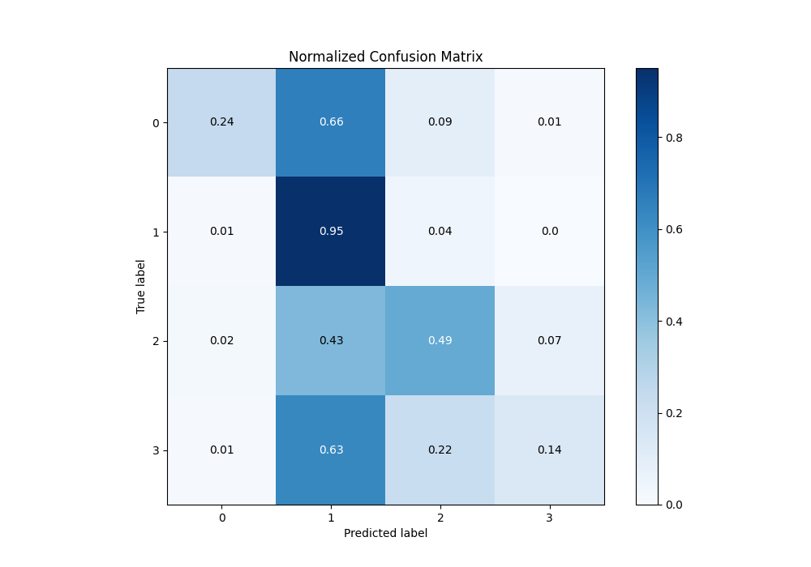
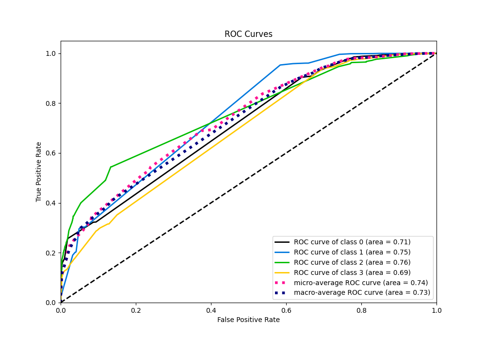
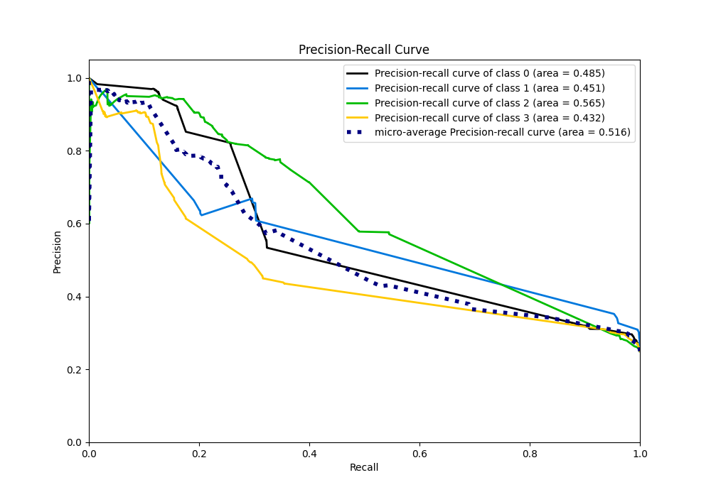

# Summary of 5_RandomForest

[<< Go back](../README.md)

## Random Forest
- **n_jobs**: -1
- **criterion**: gini
- **max_features**: 0.5
- **min_samples_split**: 20
- **max_depth**: 4
- **eval_metric_name**: logloss
- **num_class**: 4
- **explain_level**: 2

## Validation
 - **validation_type**: split
 - **train_ratio**: 0.75
 - **shuffle**: True
 - **stratify**: True

## Optimized metric
logloss

## Training time

18.1 seconds

### Metric details
|           |           0 |           1 |           2 |           3 |   accuracy |    macro avg |   weighted avg |   logloss |
|:----------|------------:|------------:|------------:|------------:|-----------:|-------------:|---------------:|----------:|
| precision |    0.851607 |    0.356593 |    0.584082 |    0.663603 |   0.455467 |     0.613971 |       0.613971 |   1.21284 |
| recall    |    0.240267 |    0.951867 |    0.485333 |    0.1444   |   0.455467 |     0.455467 |       0.455467 |   1.21284 |
| f1-score  |    0.374792 |    0.518823 |    0.530149 |    0.237188 |   0.455467 |     0.415238 |       0.415238 |   1.21284 |
| support   | 7500        | 7500        | 7500        | 7500        |   0.455467 | 30000        |   30000        |   1.21284 |

## Confusion matrix
|              |   Predicted as 0 |   Predicted as 1 |   Predicted as 2 |   Predicted as 3 |
|:-------------|-----------------:|-----------------:|-----------------:|-----------------:|
| Labeled as 0 |             1802 |             4971 |              681 |               46 |
| Labeled as 1 |               54 |             7139 |              293 |               14 |
| Labeled as 2 |              164 |             3207 |             3640 |              489 |
| Labeled as 3 |               96 |             4703 |             1618 |             1083 |

## Learning curves

## Permutation-based Importance

## Confusion Matrix

## Normalized Confusion Matrix

## ROC Curve

## Precision Recall Curve

[<< Go back](../README.md)
