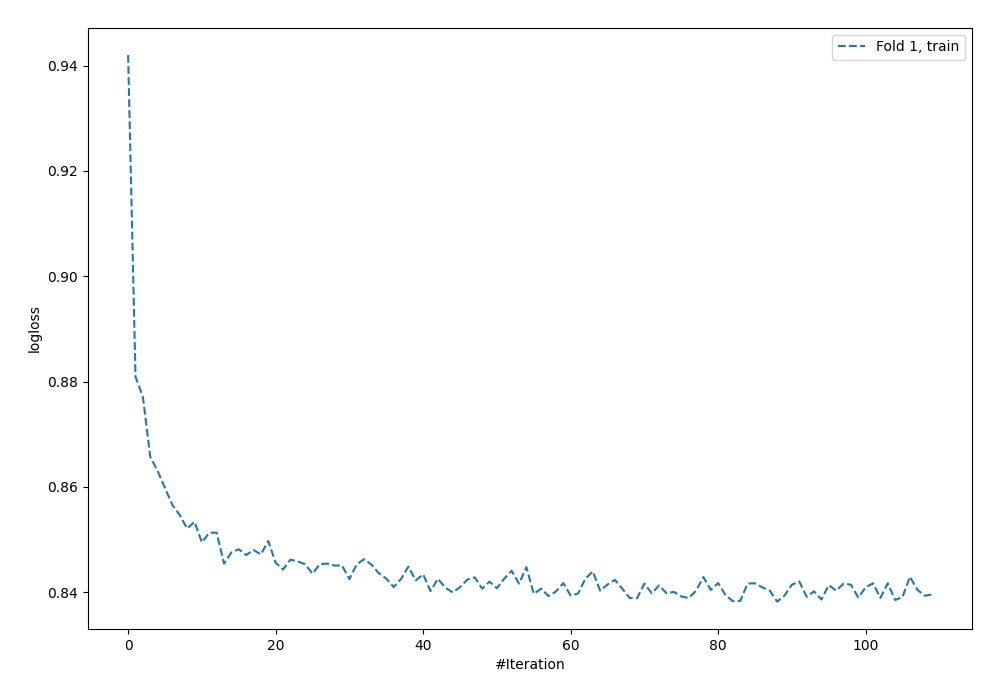
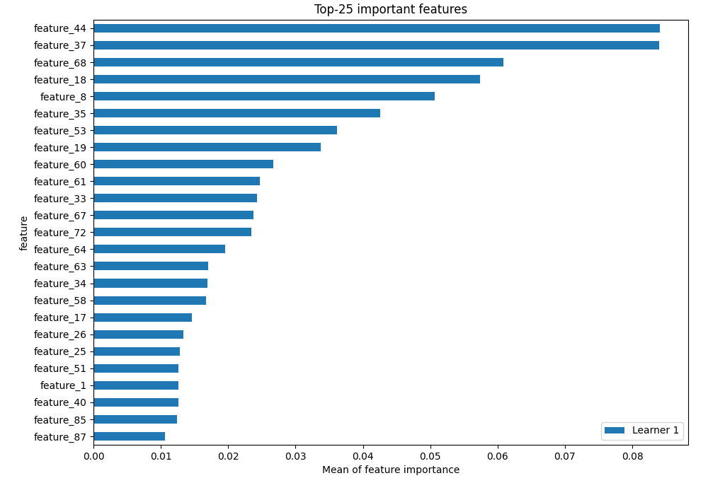
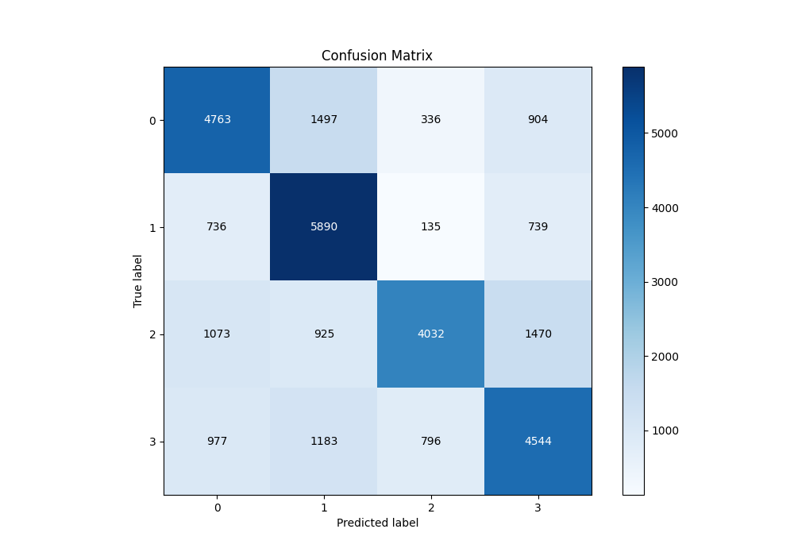
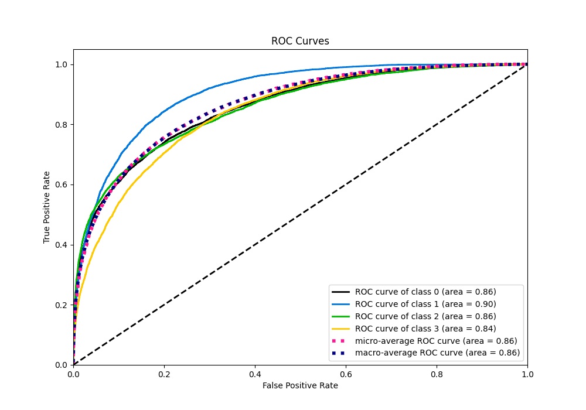
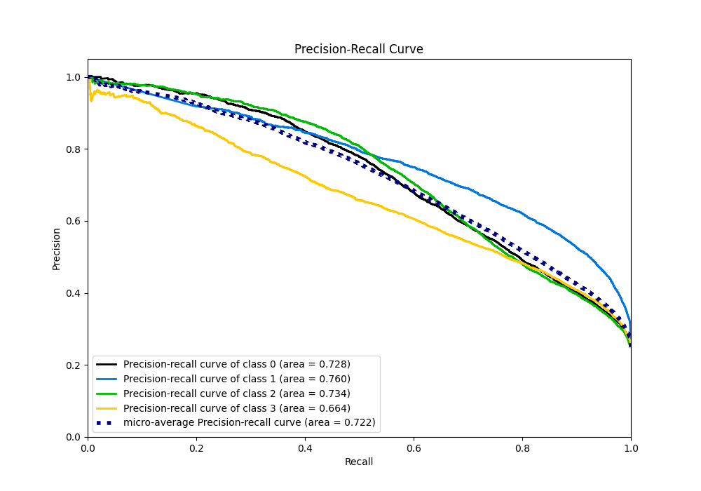

# Summary of 6_NeuralNetwork

[<< Go back](../README.md)

## Neural Network
- **n_jobs**: -1
- **dense_1_size**: 32
- **dense_2_size**: 4
- **learning_rate**: 0.05
- **num_class**: 4
- **explain_level**: 2

## Validation
 - **validation_type**: split
 - **train_ratio**: 0.75
 - **shuffle**: True
 - **stratify**: True

## Optimized metric
logloss

## Training time

179.4 seconds

### Metric details
|           |           0 |           1 |           2 |           3 |   accuracy |    macro avg |   weighted avg |   logloss |
|:----------|------------:|------------:|------------:|------------:|-----------:|-------------:|---------------:|----------:|
| precision |    0.630944 |    0.620326 |    0.760898 |    0.593444 |   0.640967 |     0.651403 |       0.651403 |  0.884348 |
| recall    |    0.635067 |    0.785333 |    0.5376   |    0.605867 |   0.640967 |     0.640967 |       0.640967 |  0.884348 |
| f1-score  |    0.632999 |    0.693145 |    0.630049 |    0.599591 |   0.640967 |     0.638946 |       0.638946 |  0.884348 |
| support   | 7500        | 7500        | 7500        | 7500        |   0.640967 | 30000        |   30000        |  0.884348 |

## Confusion matrix
|              |   Predicted as 0 |   Predicted as 1 |   Predicted as 2 |   Predicted as 3 |
|:-------------|-----------------:|-----------------:|-----------------:|-----------------:|
| Labeled as 0 |             4763 |             1497 |              336 |              904 |
| Labeled as 1 |              736 |             5890 |              135 |              739 |
| Labeled as 2 |             1073 |              925 |             4032 |             1470 |
| Labeled as 3 |              977 |             1183 |              796 |             4544 |

## Learning curves

## Permutation-based Importance

## Confusion Matrix

## Normalized Confusion Matrix

## ROC Curve

## Precision Recall Curve

[<< Go back](../README.md)
