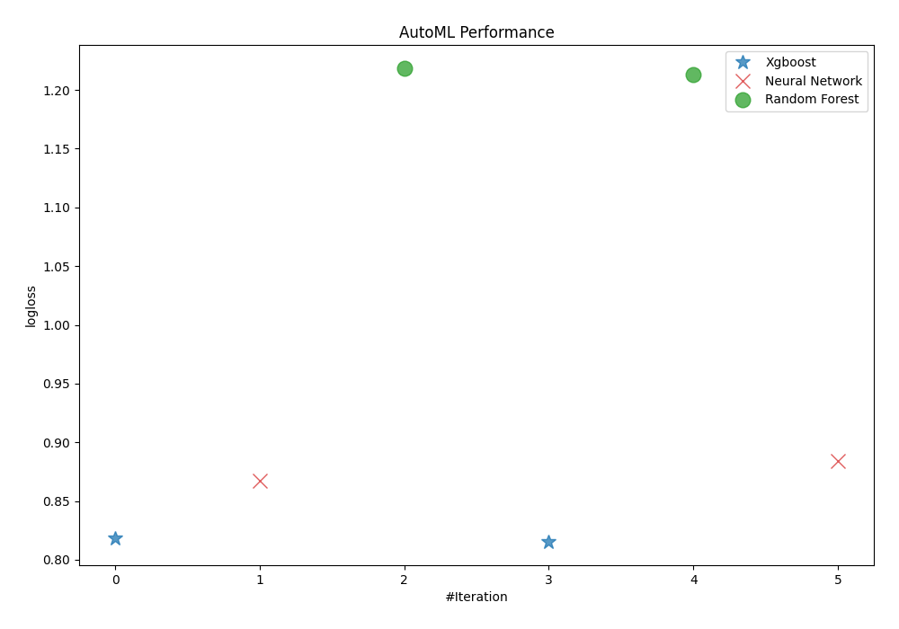
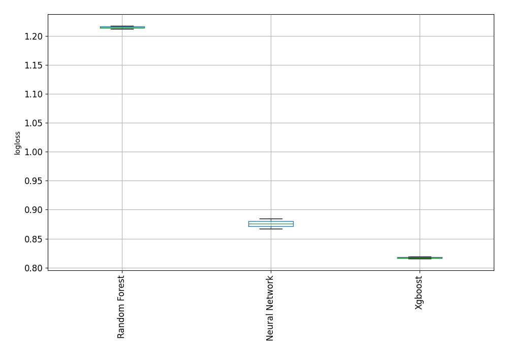
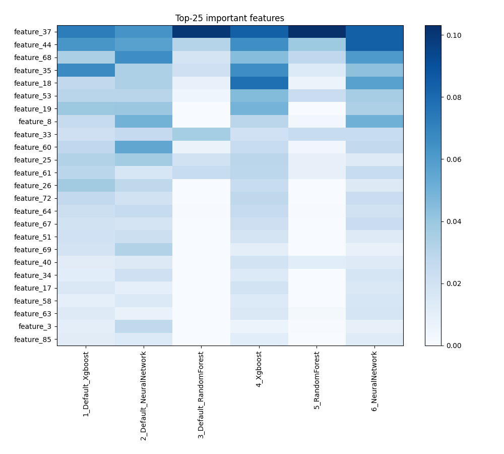
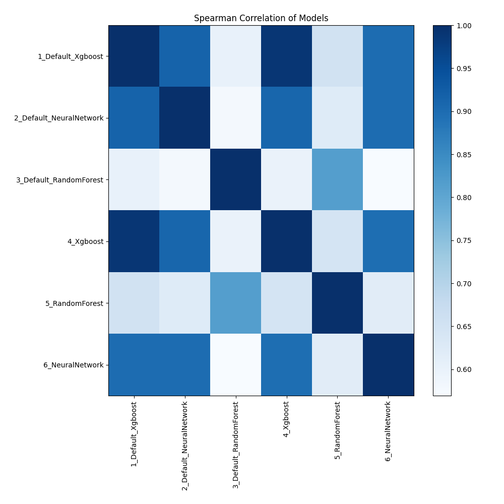

# AutoML Leaderboard

| Best model   | name                                                         | model_type     | metric_type   |   metric_value |   train_time |
|:-------------|:-------------------------------------------------------------|:---------------|:--------------|---------------:|-------------:|
|              | [1_Default_Xgboost](1_Default_Xgboost/README.md)             | Xgboost        | logloss       |       0.81851  |       130.18 |
|              | [2_Default_NeuralNetwork](2_Default_NeuralNetwork/README.md) | Neural Network | logloss       |       0.867428 |        92.34 |
|              | [3_Default_RandomForest](3_Default_RandomForest/README.md)   | Random Forest  | logloss       |       1.21806  |        19.83 |
| **the best** | [4_Xgboost](4_Xgboost/README.md)                             | Xgboost        | logloss       |       0.815552 |       133.7  |
|              | [5_RandomForest](5_RandomForest/README.md)                   | Random Forest  | logloss       |       1.21284  |        19.16 |
|              | [6_NeuralNetwork](6_NeuralNetwork/README.md)                 | Neural Network | logloss       |       0.884348 |       180.71 |

### AutoML Performance

### AutoML Performance Boxplot

### Features Importance

### Spearman Correlation of Models

